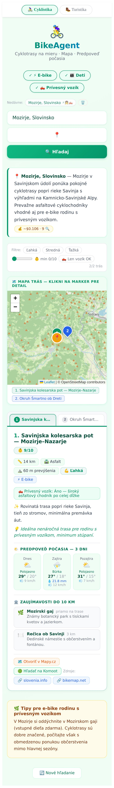
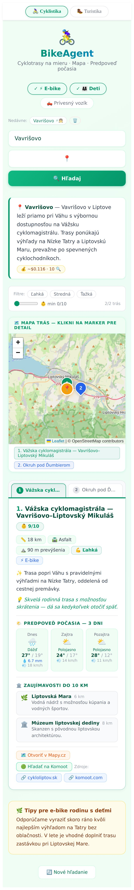
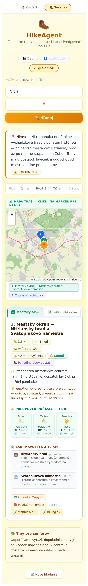
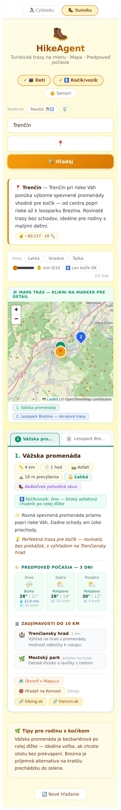

# Potulky

[](https://github.com/kozliatko/potulky/actions/workflows/build.yml)
[](https://github.com/kozliatko/potulky/actions/workflows/security.yml)
[](https://codecov.io/gh/kozliatko/potulky)
[](https://snyk.io/test/github/kozliatko/potulky)


AI agent pre hľadanie rodinných cyklociest a turistických trás. Podľa zadanej lokality (alebo GPS polohy) a parametrov vyhľadá vhodné trasy, zobrazí ich na mape a pridá predpoveď počasia.
Hobby projekt pre vlastnú potrebu robený po večeroch počas venčenia psa.

## Ukážka

BikeAgent v mobilnom PWA rozhraní pre dve reálne vyhľadávané lokality:

| Mozirje (Slovinsko) | Vavrišovo (Liptov) |
|---|---|
|  |  |

HikeAgent — profil skupiny mení kritériá aj vzhľad výsledkov (senior-friendly vs. kočík-friendly):

| Nitra — seniori | Trenčín — kočík |
|---|---|
|  |  |

## Architektúra

```
Internet
   │
   ▼
caddy-docker-proxy  (centrálna reverse proxy na serveri)
   │  TLS + HTTPS automaticky cez Let's Encrypt
   ▼
cyclo-agent kontajner  (port 3001, interný)
   │
   ├── Express.js backend  (server.js)
   │     ├── POST /api/messages   — agentic loop (DeepSeek + Tavily)
   │     ├── GET  /history        — história vyhľadávaní (chránené Caddy basic_auth)
   │     ├── GET  /health         — health check
   │     └── GET  *               — SPA fallback (React frontend)
   │
   ├── React/Vite frontend  (statické súbory servované Expressom z /public)
   │     ├── App.jsx              — prepínač módov Cyklistika / Turistika
   │     ├── BikeAgent.jsx        — agent pre cyklotrasy
   │     ├── HikeAgent.jsx        — agent pre turistiku a vychádzky
   │     └── shared.jsx           — RouteMap, WeatherForecast, GlobalStyles
   │
   └── SQLite  (/app/data/searches.db)
         └── db.js — logovanie vyhľadávaní (IP, lokalita, tokeny, trvanie, status)
```

---

## Módy aplikácie

Oba módy zdieľajú rovnaké **primárne zdroje** (`backend/prompts.js`) — všeobecné mapové platformy vhodné pre cyklo aj turistické trasy: `mapy.cz, komoot.com, openstreetmap`. Ku každému módu sa pridávajú doménovo-špecifické sekundárne zdroje.

### Cyklistika (BikeAgent)

- Profil skupiny: `{ hasEbike, hasChildren, hasTrailer }`
- Hľadá asfaltové a spevnené trasy, bezpečné pre e-bike rodinu
- Zdroje: primárne + `cycling.sk, bikemap.net, alltrails.com`
- Linky na trasy: Mapy.cz cyklomode, Komoot

### Turistika (HikeAgent)

- Profil skupiny: `{ hasChildren, hasStroller, hasSeniors }`
- Pri `hasStroller`: spevnený povrch, šírka min. 1,5 m, sklon max. 8 %, žiadne schody
- JSON schéma navyše: `strollerFriendly`, `walkingTime`, `terrain`, `footwearTip`
- Zdroje: primárne + `hiking.sk, hiking.dennikn.sk, turistika.sk`
- Linky na trasy: Mapy.cz turistický režim, Komoot hiking

---

## GPS — určenie polohy

Tlačidlo 📍 v oboch agentoch:

1. `navigator.geolocation.getCurrentPosition()` — GPS súradnice zariadenia
2. Nominatim reverse geocoding (OpenStreetMap) — `accept-language=sk`
3. Výsledok (mesto / dedina / obec) sa vloží do poľa lokality

Funguje v PWA aj prehliadači. Vyžaduje povolenie od používateľa.

---

## Backend — middleware a routes

**`backend/server.js`**

```
POST /api/messages  { mode: "bike"|"hike", profile: {...}, location: "..." }
  └── rateLimiter           (globálny: 120 req/min; API: 20 req/min na IP)
  └── buildPrompt()         (server si sám skladá system prompt aj user message —
                              klient neposiela system/messages/max_tokens)
  └── denná kvóta           (MAX_REQUESTS_PER_IP_PER_DAY=15, MAX_GLOBAL_REQUESTS_PER_DAY=300 —
                              429/503 pri prekročení, konfigurovateľné cez .env)
  └── runAgent()
        └── agentic loop: DeepSeek V3 + Tavily Search (max 10 vyhľadávaní, max 25 iterácií)
                            max_tokens fixné na 8000, nedá sa prepísať klientom
  └── insertSearch()        (SQLite logging)
  └── { content: [{ type: "text", text }], usage }

GET /history
  └── Caddy basic_auth      (path-scoped, gatuje request pred appkou)
  └── HTML tabuľka vyhľadávaní s filtráciou

GET /health               → { status: "ok", timestamp }
GET *                     → index.html  (SPA fallback)
```

**Limit vyhľadávaní:** Po 10 Tavily volaniach dostane agent správu "zosumarizuj čo máš" — zabraňuje timeoutom pri zahraničných lokalitách.

---

## PWA

| Súčasť | Popis |
|--------|-------|
| `vite-plugin-pwa` | Service worker (Workbox) + `manifest.webmanifest` |
| Manifest | Názov: Potulky – Cyklotrasy & Turistika, téma #059669 |
| Ikony | 64 / 192 / 512 px PNG + maskable 512 + Apple Touch 180 + favicon.ico |

**Cache stratégie:**

| URL vzor | Stratégia | Detail |
|----------|-----------|--------|
| `/api/*` | NetworkOnly | AI vyhľadávanie vždy cez sieť |
| `api.open-meteo.com` | NetworkFirst | Počasie, cache 1 hod |
| `*.tile.openstreetmap.org` | CacheFirst | Mapové dlaždice, cache 7 dní |
| Statické assets | Precache | JS, CSS, HTML, PNG, SVG |

**Aktualizácie:** `registerType: "prompt"` — nová verzia sa nenasadí potichu (mohla by zmazať rozpísaný vstup), appka zobrazí banner "🔄 K dispozícii je nová verzia Potuliek" s tlačidlom **Obnoviť teraz**. Kontrola beží hodinovo a pri návrate appky z pozadia (`visibilitychange`); ak si banner nikto nevšimne, appka sa po 60 s obnoví sama.

---

## Požiadavky

- Docker + Docker Compose v2
- Centrálna `caddy-docker-proxy` sieť: `docker network create caddy`
- `DEEPSEEK_API_KEY`, `TAVILY_API_KEY`

---

## Inštalácia

### 1. Nastav env premenné

```bash
cp .env.example .env
nano .env
```

```env
DEEPSEEK_API_KEY=sk-...
TAVILY_API_KEY=tvly-...
HISTORY_PASSWORD_HASH=$2a$14$...
```

> `HISTORY_PASSWORD_HASH` je bcrypt hash hesla pre `/history` — vygeneruj cez `docker exec caddy caddy hash-password --plaintext 'tvoje-heslo'`.
>
> `/api/messages` nie je chránené tokenom — appka je verejná služba. Ochrana proti zneužitiu ide cez rate limiting a server-side limity (server si sám skladá system prompt, `max_tokens` je fixný, klient nemôže poslať vlastné inštrukcie).

### 2. Spusti

```bash
docker compose up -d --build
```

Caddy-docker-proxy zaregistruje kontajner a app je dostupná na doméne nastavenej v `docker-compose.yml` (label `caddy:`).

---

## História vyhľadávaní

`/history` je chránený priamo na úrovni Caddy (`basic_auth`, path-scoped na presnú zhodu `/history` — nie prefix `/history*`, ktorý by chytil aj statický `/history.js`) — v prehliadači sa zobrazí natívny prihlasovací dialóg, prihlásiš sa menom a heslom nastaveným cez `HISTORY_PASSWORD_HASH`.

Dve záložky:

- **História** — čas, IP, lokalita, počet vyhľadávaní, tokeny, trvanie, status (ok/error), s filtrami
- **Kvóty a náklady** — globálny denný limit s progress barom (`X / MAX_GLOBAL_REQUESTS_PER_DAY`), per-IP breakdown za dnešok (počet požiadaviek/limit na IP, vyhľadávania, tokeny, odhadovaná útrata v $)

**Retencia:** záznamy staršie ako `HISTORY_RETENTION_DAYS` (default 90 dní) sa automaticky mažú pri štarte appky a potom každých 24 hodín.

---

## Bezpečnostné hlavičky

Nastavené cez Caddy labely v `docker-compose.yml` (`caddy.header.*`):

| Hlavička | Hodnota |
|---|---|
| `Content-Security-Policy` | obmedzuje zdroje na `'self'` + explicitne povolené domény (Leaflet CDN, OSM dlaždice, Open-Meteo, Nominatim) |
| `X-Frame-Options` | `SAMEORIGIN` |
| `X-Content-Type-Options` | `nosniff` |
| `Referrer-Policy` | `strict-origin-when-cross-origin` |
| `Strict-Transport-Security` | `max-age=31536000; includeSubDomains` |

> Viacslovné hodnoty (CSP, HSTS) musia mať v YAML labeli doslovné úvodzovky (`'"hodnota"'`), inak ich Caddy Caddyfile parser potichu odmietne.

---

## Testovanie

### Unit testy (backend)

```bash
cd backend && npm test
```

### Smoke testy

```bash
docker run --rm \
  --network cyclo-agent_default \
  -e BASE_URL=http://cyclo-agent:3001 \
  -v $(pwd)/tests:/tests \
  node:22-alpine node --test /tests/smoke.test.js
```

### Všetky testy

```bash
npm run test:all
```

---

## Správa

```bash
# Stav
docker compose ps

# Logy
docker compose logs -f

# Rebuild + reštart (po zmene kódu)
docker compose up -d --build

# Zastavenie
docker compose down
```

---

## Štruktúra projektu

```
potulky/
├── docker-compose.yml          # caddy-docker-proxy labely, sieť caddy external
├── Dockerfile                  # multi-stage: frontend build → backend + SQLite
├── .env.example                # šablóna env premenných
├── package.json                # skripty na spustenie testov
│
├── tests/
│   └── smoke.test.js           # smoke testy
│
├── backend/
│   ├── server.js               # Express: agentic loop, auth, rate limit, logging
│   ├── db.js                   # SQLite schéma + queries (better-sqlite3)
│   ├── server.test.js
│   └── package.json
│
└── frontend/
    ├── src/
    │   ├── main.jsx
    │   ├── App.jsx             # prepínač módov, GlobalStyles
    │   └── components/
    │       ├── BikeAgent.jsx   # cyklotrasy
    │       ├── HikeAgent.jsx   # turistika a vychádzky
    │       └── shared.jsx      # RouteMap, WeatherForecast, GlobalStyles, utils
    ├── public/                 # ikony (SVG, PNG, ICO)
    ├── index.html
    └── vite.config.js          # PWA konfigurácia
```

---

## Riešenie problémov

**Timeout / 504 pri zahraničných lokalitách**
→ Caddy timeout je 300 s. Ak trvá dlhšie, agent prekročil 10 vyhľadávaní — skontroluj `/history`.

**`402 Insufficient Balance` (DeepSeek)**
→ Nabiť kredit na [platform.deepseek.com](https://platform.deepseek.com)

**`Chyba spracovania JSON`**
→ Otvor DevTools → Console — raw AI odpoveď je zalogovaná ako `[BikeAgent] Raw AI response`.

**GPS tlačidlo nefunguje**
→ Prehliadač vyžaduje HTTPS alebo localhost. Na HTTP doméne geolokácia nie je dostupná.

**`/history` pýta prihlásenie, ktoré neuznáva heslo**
→ Over `HISTORY_PASSWORD_HASH` v `.env` — musí byť platný bcrypt hash z `caddy hash-password`, nie plaintext heslo.

**`429 Too Many Requests` / `503 Service Unavailable`**
→ Prekročená denná kvóta (`MAX_REQUESTS_PER_IP_PER_DAY` na IP, `MAX_GLOBAL_REQUESTS_PER_DAY` globálne). Aktuálne čerpanie je vidieť v `/history` na záložke **Kvóty a náklady**, limity sa resetujú o polnoci UTC.

---

## Changelog

Pozri [CHANGELOG.md](CHANGELOG.md) pre kompletnú históriu zmien.

### v2.1.0
- **Bezpečnostná prestavba**: server-side prompt building (klient už neposiela `system`/`messages`/`max_tokens`), odstránený `API_SECRET_TOKEN` (bol viditeľný vo verejnom bundli)
- Denné kvóty (per-IP aj globálne) a retencia dát (`HISTORY_RETENTION_DAYS`)
- `/history` chránený Caddy `basic_auth`, nová záložka **Kvóty a náklady**
- CSP + bezpečnostné hlavičky cez Caddy `caddy.header.*` labely
- Opravené: XSS v `/history`, PWA neaktualizovala otvorenú záložku, mapa sa neprekresľovala pri zmene výsledku, CSP regresia blokujúca `/history` UI
- CI: GitHub Actions (testy, build, gitleaks, npm audit, Codecov)
- Odstránené legacy `nginx.conf`/`Dockerfile.dev`/`docker-compose.dev.yml` a nepoužívaná `@anthropic-ai/sdk` závislosť

### v2.0.0
- Premenovaný projekt: BikeAgent → Potulky
- Nový mód: HikeAgent — turistika s podporou kočíka, detí a seniorov
- GPS tlačidlo s Nominatim reverse geocodingom (OSM)
- SQLite logovanie vyhľadávaní (db.js)
- /history endpoint — chránený Caddy basic_auth (path-scoped)
- Limit vyhľadávaní vynútený v kóde (max 10 Tavily volaní)
- Caddy timeout: 120 s → 300 s
- Zdroje vo výstupe klikateľné
- Deployment: lokálny Caddy → caddy-docker-proxy

### v1.1.0
- Responzívny dizajn, zlatý marker na mape
- `extractFirstJSON()` odolné voči textu za JSON blokom
- Debugovanie raw AI odpovede v konzole

### v1.0.0
- Základná verzia: vyhľadávanie cyklotrás, Leaflet mapa, predpoveď počasia
- Profil skupiny, história vyhľadávaní, filtrovanie trás
